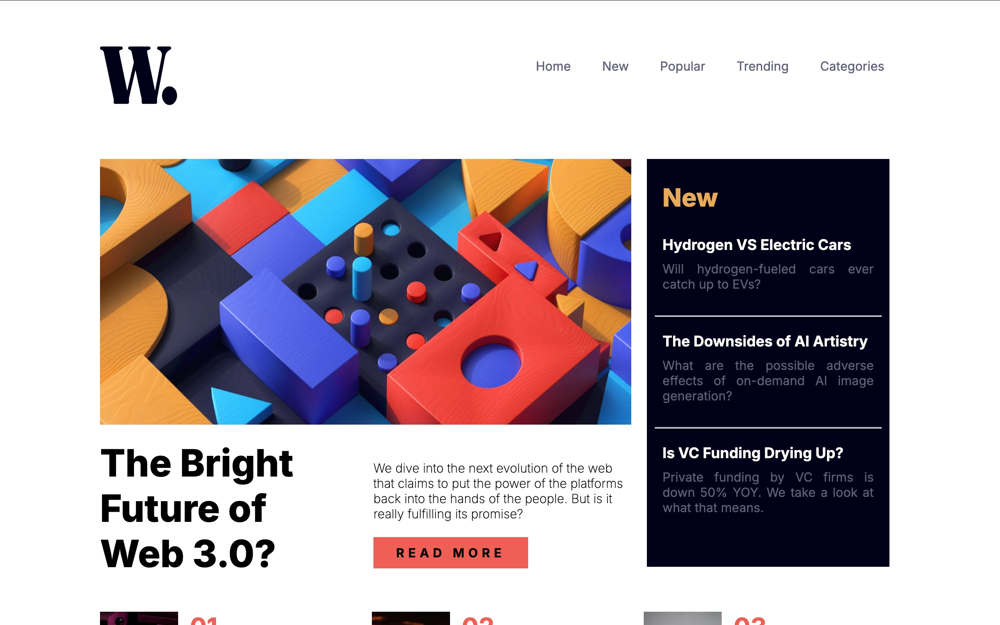

# Frontend Mentor - News homepage solution


## Table of contents

- [Overview](#overview)
  - [The challenge](#the-challenge)
  - [Screenshot](#screenshot)
- [My process](#my-process)
  - [Built with](#built-with)
  - [What I learned](#what-i-learned)
- [Author](#author)


## Overview

### The challenge

Users should be able to:

- This is a solution to the [News homepage challenge on Frontend Mentor](https://www.frontendmentor.io/challenges/news-homepage-H6SWTa1MFl). Frontend Mentor challenges help you improve your coding skills by building realistic projects. 


### Screenshot




### Links

- Solution URL: []
- Live Site URL: [https://sayon-okai.github.io/news-homepage-main/]

## My process

### Built with

- Semantic HTML5 markup
- CSS custom properties
- CSS Grid
- Mobile-first workflow
- Js


### What I learned

I was able to use jquery to add interactivity to project using click handler 
and other jquery method 


```css
  .sidebar {
    position: fixed;
    top: 0;
    right: 0;
    height: 100vh;
    width: 250px;
    z-index: 999;
    background-color: #fff;
    display: none;
    flex-direction: column;
    align-items: flex-start;
    justify-content: flex-start;
    padding-top: 10%;
}
```

## Author

- Frontend Mentor - [Sayon-okai](https://www.frontendmentor.io/profile/Sayon-okai)
- GitHub - [Sayon-okai](https://github.com/Sayon-okai)


